# 📊 PLAN DE SUIVI D'IMPLÉMENTATION - MODULE GESTION DE STOCK (PMP)

> **Projet :** ERP OCM_SHINE  
> **Composant :** Module Stock (Refonte Frontend)  
> **Méthodologie :** PMP (Project Management Professional)  
> **Statut :** En cours (Alignement Spécifications v2.0)

---

## 1. CHARTE DU PROJET (FRONTEND FOCUS)

### 1.1 Objectifs du Projet
- **Alignement Spécifications** : Mettre en conformité le module stock existant avec les spécifications `Permissions_Gestion_Stock_Optimise.md`.
- **Excellence UX/UI** : Offrir une interface moderne, épurée et réactive (Angular 17+) respectant le template premium de l'ERP.
- **Sécurité Granulaire** : Implémenter le contrôle d'accès basé sur les rôles (RBAC) au niveau des composants et des actions.
- **Multi-Site** : Assurer la gestion fluide des mouvements entre entrepôts et sites distants.

### 1.2 Parties Prenantes
- **Product Owner** : Direction métier (Validation fonctionnelle).
- **Développeur Frontend (Moi)** : Responsable de l'UI/UX et de l'intégration métier.
- **Scrum Master (IA)** : Suivi méthodologique et support technique.

### 1.3 Contraintes & Hypothèses
- **Contrainte** : Pas d'usage intensif de scanneurs (focus clavier/souris/interface tactile standard).
- **Hypothèse** : Les API Backend supportent déjà ou supporteront les nouveaux codes de permissions.
- **Hypothèse** : Le template `ocm` fournit les composants de base (modales, tables, loaders).

---

## 2. WBS (WORK BREAKDOWN STRUCTURE)

```mermaid
graph TD
    WBS["Module Stock PMP"] --> WP1["1. Initialisation & Audit"]
    WBS --> WP2["2. Structure & Navigation"]
    WBS --> WP3["3. Opérations & Workflows"]
    WBS --> WP4["4. Sécurité & Permissions"]
    WBS --> WP5["5. Reporting & Clôture"]

    WP1 --> WP1.1["Audit code existant"]
    WP1 --> WP1.2["Setup Data Tracing (PMP)"]

    WP2 --> WP2.1["Refonte Dashboard Stock"]
    WP2 --> WP2.2["Gestion Référentiel (Articles/Entrepôts)"]
    WP2 --> WP2.3["Multi-site Breadcrumbs & Context"]

    WP3 --> WP3.1["Flux Entrées/Sorties"]
    WP3 --> WP3.2["Moteur de Transferts inter-sites"]
    WP3 --> WP3.3["Interface Inventaire Multi-comptage"]

    WP4 --> WP4.1["Directive de Permissions UI"]
    WP4 --> WP4.2["Gestion des Rôles & Visibilité"]

    WP5 --> WP5.1["États Valorisation & KPIs"]
    WP5 --> WP5.2["UAT (User Acceptance Testing)"]
```

---

## 3. PLAN DE MANAGEMENT DES RISQUES

| Risque | Impact | Probabilité | Stratégie d'Atténuation |
|:-------|:-------|:------------|:------------------------|
| **Désalignement API** | Élevé | Moyenne | Validation précoce des contrats d'interface (Swagger/DTO). |
| **Complexité RBAC** | Moyen | Haute | Utilisation d'une directive Angular dédiée (`*appHasPermission`). |
| **Régression UI** | Moyen | Basse | Tests unitaires sur les composants critiques et revue visuelle systématique. |
| **Performance Multi-site** | Élevé | Basse | Pagination rigoureuse et mise en cache des référentiels (Signals/RxJS). |

---

## 4. REGISTRE DE SUIVI DES TÂCHES (TRACÉABILITÉ PMP)

| ID | Tâche | Priorité | État | Responsable | Échéance |
|:---|:------|:---------|:-----|:------------|:---------|
| STK-001 | Création du fichier de suivi PMP | P0 | ✅ Terminé | FE Dev | 2026-02-10 |
| STK-002 | Audit du module stock existant | P1 | ✅ Terminé | FE Dev | 2026-02-10 |
| STK-003 | Mise à jour du Dashboard (UX Épuré) | P1 | ✅ Terminé | FE Dev | 2026-02-10 |
| STK-004 | Implémentation Logique Multi-site | P0 | ✅ Terminé | FE Dev | 2026-02-10 |
| STK-005 | Matrice de Permissions UI (RBAC) | P0 | ✅ Terminé | FE Dev | 2026-02-10 |
| STK-006 | Refonte des pages Stock (UI/UX) | P1 | ✅ Terminé | FE Dev | 2026-02-10 |

---

## 5. NOTES D'UX & DESIGN SYSTEM
- **Couleurs** : Utiliser les variables CSS du thème primary pour les actions positives.
- **Feedback** : Notifications toast systématiques après validation d'entrée/sortie.
- **Clarté** : Utilisation de "Empty States" élégants quand aucun mouvement n'est présent.
- **Navigation** : Breadcrumbs dynamiques (déjà amorcés dans les sprints précédents).

---
*Document généré par Antigravity - Expert Frontend / PMP Advisor*
